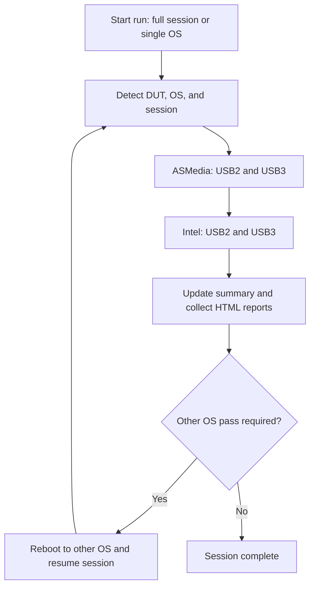

# CV Suite Automator

Windows automation toolkit for USB-IF CV Suite regression and qualification runs on Apricorn devices.

The project automates high-friction validation steps across:
- Host controllers (ASMedia and Intel)
- USB protocol modes (USB2 and USB3)
- Dual-boot Windows environments (Windows 10 and Windows 11)

It is intentionally semi-automated: software orchestration is scripted end-to-end, while one physical DUT port move is still required between controller passes.

## At a glance

- Problem: USB-IF CV Suite runs are repetitive and error-prone across controllers, protocol modes, and dual-boot OS passes.
- Stack: Python automation with `pywinauto` (CV Suite UI), `Phidget22` (relay control), and batch/PowerShell orchestration.
- Outcome: deterministic session outputs (`summary.json` + structured report hierarchy) for regression and qualification evidence.

## Why this exists

USB-IF CV Suite runs are repetitive, stateful, and easy to derail when you are moving between host controllers, USB protocol paths, and dual-boot OS setups. This project provides a deterministic orchestration layer that:
- Drives CV Suite through scripted UI interactions (`pywinauto`)
- Controls lab relay hardware (`Phidget22`) for USB path switching
- Persists progress and report artifacts in a structured, repeatable folder model

## Architecture



## Deep Dive

### 1. Session continuity across dual-boot runs

The automation is built for Windows 10/11 cross-OS validation sessions. It discovers whether to continue an in-flight session or create a new one, then keeps progress in a shared `summary.json` so the second OS pass can resume deterministically.

### 2. Deterministic test matrix execution

Each OS pass runs a fixed controller/protocol matrix (ASMedia + Intel, USB2 + USB3) through CV Suite UI automation. Protocol execution order can vary by detected device state, but both protocol modes are exercised per controller pass. This avoids ad hoc operator sequencing and makes runs easier to compare across regression cycles.

### 3. Lab hardware orchestration

The relay layer (`Phidget22`) controls switchboard channels used during automation (`power`, `usb3`). This allows software-driven state changes where possible and reduces manual handling to the minimum required physical actions.

### 4. Structured artifact model for reviewability

Reports are pulled into a stable hierarchy under `M:\USB-IF Results\...`, and pass/fail metadata is written into session summary JSON. The output layout is designed for fast triage, rerun tracking, and qualification evidence packaging.

### 5. Operational packaging for lab environments

The project ships with modern Python packaging metadata (`pyproject.toml`), offline wheel support for constrained lab hosts, and small utility-focused tests backed by CI for quick confidence on non-hardware logic.

## Environment requirements

Hardware:
- Dual-boot Windows 10/11 validation host (for full session)
- DUT (for example, Apricorn secure storage)
- Phidgets IO controller and USB2/USB3 switchboard
- External results drive mounted as `M:`

Software:
- Python 3.12+
- USB-IF CV Suite installed on both Windows partitions
- Local dependencies from `wheels/` for offline installs (including `usb-tool`)

## Assumptions

- Results target drive is mounted as `M:` during execution.
- CV Suite is installed and accessible in expected host-specific paths.
- Lab host usernames and path conventions match script expectations.
- DUT is connected and unlocked when the run starts.

## Install

Offline/local wheel install (recommended for lab machines):

```powershell
pip install --no-index --find-links=./wheels -r requirements.txt
```

Editable install:

```powershell
pip install -e .
```

## Run

Single-OS run:

```powershell
scripts\run_automation.bat "{chipset}"
```

Full dual-OS session:

```powershell
scripts\start_cv_suite_session.bat "{chipset}"
```

Operator workflow:
- Start the full session script on the first OS.
- Perform the single required physical cable move when prompted.
- Let the machine reboot and resume on the second OS.
- Review merged artifacts in the session output directory.

## Output model

Test artifacts are written to a structured session directory:

```text
M:\USB-IF Results\<chipset + product>\v<bcdDevice>\<capacity>GB\<timestamp>\
```

Each session stores:
- Per-OS report folders (Windows 10 and Windows 11)
- Per-controller and per-protocol report splits (ASMedia/Intel, USB2/USB3)
- A `summary.json` file that tracks completion and pass/fail outcomes

## Development checks

Run fast unit tests (no hardware required):

```powershell
$env:PYTHONPATH = "$pwd\src"
pytest tests -q
```

CI workflow: `.github/workflows/ci.yml`

## Limitations

- One manual cable move between controllers is still required.
- End-to-end execution depends on lab-specific hardware, OS usernames, and CV Suite installation paths.
- The automation assumes Windows-only tooling (`pywinauto`, batch/PowerShell wrappers).
- UI automation reliability is coupled to CV Suite window/control behavior and may require updates if UI layouts change.
