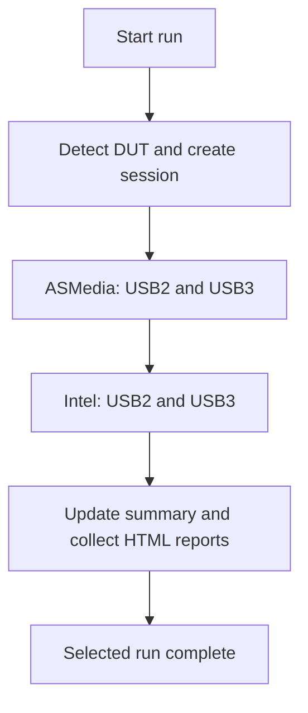

# CV Suite Automator

Windows automation toolkit for USB-IF CV Suite regression and qualification runs on Apricorn devices.

The project automates high-friction validation steps across:
- Host controllers (ASMedia and Intel)
- USB protocol modes (USB2 and USB3)
- Windows 11 test hosts

It is intentionally semi-automated: software orchestration is scripted end-to-end, while one physical DUT port move is still required between controller passes.

## At a glance

- Problem: USB-IF CV Suite runs are repetitive and error-prone across controllers and protocol modes.
- Stack: Python automation with `pywinauto` (CV Suite UI), `Phidget22` (relay control), and batch/PowerShell orchestration.
- Outcome: deterministic session outputs (`summary.json` + structured report hierarchy) for regression and qualification evidence.

## Why this exists

USB-IF CV Suite runs are repetitive, stateful, and easy to derail when moving between host controllers and USB protocol paths. This project provides a deterministic orchestration layer that:
- Drives CV Suite through scripted UI interactions (`pywinauto`)
- Controls lab relay hardware (`Phidget22`) for USB path switching
- Persists progress and report artifacts in a structured, repeatable folder model

## Architecture


```mermaid
flowchart TD
  A["Start run"] --> B["Detect DUT and create session"]
  B --> C["ASMedia: USB2 and USB3"]
  C --> E["Intel: USB2 and USB3"]
  E --> G["Update summary and collect HTML reports"]
  G --> H["Selected run complete"]
```

## Deep Dive

### 1. Windows 11 test sessions

Each invocation creates a unique Windows 11 session and records its selected test scope in `summary.json` and the structured report hierarchy.

### 2. Configurable test matrix execution

Each run executes the tests, controllers, and USB protocols chosen at startup.
Pressing Enter at every selection preserves the complete ASMedia/Intel and
USB2/USB3 matrix.

### 3. Lab hardware orchestration

The relay layer (`Phidget22`) controls switchboard channels used during automation (`power`, `usb3`). This allows software-driven state changes where possible and reduces manual handling to the minimum required physical actions.

### Fault-tolerant UI supervision

CV Suite windows are monitored as events instead of being assumed to appear in
a fixed order. Recognized failures are recorded immediately, delayed controls
are retried, and unknown popups pause for operator review. Intervention
checkpoints wait for an explicit Enter acknowledgement without creating separate
diagnostic screenshots or JSON artifacts.
After a device-loss failure, that acknowledgement is authoritative because CV
Suite's compliance driver can prevent the bundled USB discovery tool from seeing
the DUT.

### 4. Structured artifact model for reviewability

Reports are pulled into a stable hierarchy under `M:\USB-IF Results\...`, and pass/fail metadata is written into session summary JSON. The output layout is designed for fast triage, rerun tracking, and qualification evidence packaging.

### 5. Operational packaging for lab environments

The project ships with modern Python packaging metadata (`pyproject.toml`), offline wheel support for constrained lab hosts, and small utility-focused tests backed by CI for quick confidence on non-hardware logic.

## Environment requirements

Hardware:
- Windows 11 validation host
- DUT (for example, Apricorn secure storage)
- Phidgets IO controller and USB2/USB3 switchboard
- External results drive mounted as `M:`

Software:
- Python 3.12+
- uv 0.12.9+
- USB-IF CV Suite installed on Windows 11
- Local Python dependencies from `wheels/` for offline installs
- The bundled `usb-windows.exe` device-discovery tool (included with the package)

## Assumptions

- Results target drive is mounted as `M:` during execution.
- CV Suite is installed and accessible in expected host-specific paths.
- The active Windows profile contains the CV Suite shortcut and report folders.
- DUT is connected and unlocked when the run starts.

## Install

Create or update the locked project environment from the committed wheelhouse:

```console
uv sync
```

For a lab host without network access, require offline operation explicitly:

```console
uv sync --offline
```

## Run

Run:

```console
uv run usb-if run "{chipset}"
```

At startup, the runner presents numbered Test, Controller, and USB Protocol
selections. Enter one or more space-separated numbers, or press Enter at a
prompt to run all of its options. Chapter 9 automatically maps to the correct
USB2 or USB3 suite. UASP is offered provisionally before DUT enumeration and
is skipped automatically when the selected device does not support it. After
USB Protocol Selection, enter the storage manufacturer used to label the
capacity results directory.

Operator workflow:
- Start the automation with `uv run usb-if run "{chipset}"`.
- If both controllers were selected, perform the physical cable move when prompted.
- Review artifacts in the session output directory.

## Output model

Test artifacts are written to a structured session directory:

```text
M:\USB-IF Results\<chipset + product>\v<bcdDevice>\<capacity>GB <manufacturer>\<timestamp>\
```

Each session stores:
- Windows 11 report folders
- Per-controller and per-protocol report splits (ASMedia/Intel, USB2/USB3)
- A `summary.json` file that tracks completion and pass/fail outcomes

The automator tracks reports created by each automated test, verifies an
external backup, and retains another copy under the CV Suite output directory
using the same device/session/OS/controller/protocol hierarchy. Existing CV
Suite output, including reports from manual runs, is left untouched.

### Parse failures

Create a failure breakdown for exactly one firmware version:

```console
uv run usb-if parse "M:\USB-IF Results\<product>\<firmware_version>"
```

The selected directory must be the firmware directory, not the product
directory containing multiple firmware versions. The command reads every
capacity, timestamped session, and HTML report beneath it, then writes
`results.json` alongside the capacity directories. Each capacity lists its
exact `Test-Fail` entries with operating-system, controller, protocol, and
suite context. Both top-level sections group failures by operating system, USB
controller, and USB protocol so those values are not repeated on every failure.
The `aggregate` object appears first, sums CV Suite's reported failure counts
across all capacities, and adds a `DUTs` list containing the unique, naturally
sorted capacity-folder names that contributed to each failure. The `capacities`
breakdown follows it and lists only `suite` and `test`; occurrence counts are
omitted there because they are represented by the aggregate. Every failed
attempt is counted, including an attempt followed by a passing rerun; suite
failures that name no individual test are reported as
`Unattributed suite failure`. The known CV Suite noise messages
`No MSC/BOT Device selected for testing.` and
`No USB Device selected for testing.`, as well as the message stating that no
Enhanced SuperSpeed devices were detected, are excluded unless the same report
contains a separately attributed test failure.

## Development checks

Run fast unit tests (no hardware required):

```console
uv run pytest
```

Install the repository's pre-commit and pre-push hooks once per clone:

```console
uv run python -m tools.install_hooks
```

Run the exact Windows CI gate locally from a clean working tree:

```console
uv run python tools/quality_gate.py
```

The pre-commit hook fixes formatting and basic text hygiene. The pre-push hook
runs the complete check-only gate used by CI: text validation, configuration
validation, compilation, Ruff, mypy, project-version consistency, and pytest.

CI workflow: `.github/workflows/ci.yml`

## Limitations

- A manual cable move is required only when both controllers are selected.
- End-to-end execution depends on lab-specific hardware and CV Suite installation paths.
- The automation assumes Windows-only UI tooling (`pywinauto`).
- UI automation reliability is coupled to CV Suite window/control behavior and may require updates if UI layouts change.
